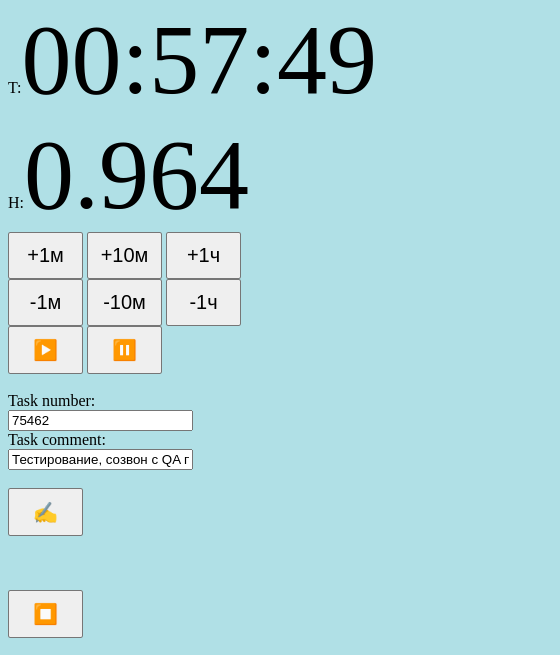

# time-tracker

Трекальщик времени для редмайна.  
Написан на коленке по мере появления какой-либо рутины с треканьем:
- надо трекать с точностью в 30 мин
- записать начало работы
- записать конец
- посчитать
- если отошёл надо записать
- позвали на созвон - надо записать в другую задачу, по которой созвон
- и тп

Запускается как есть прямо из файла [index.html](index.html)  
Добавил в github page  
https://svs13.github.io/time-tracker/index.html

Закрепляйте вкладку, надо включить ещё таймер по другой задаче - дублируйте закреплённую вкладку.

TODO: порефакторить, чтоб стало по архитектуре.

Скрин:  

